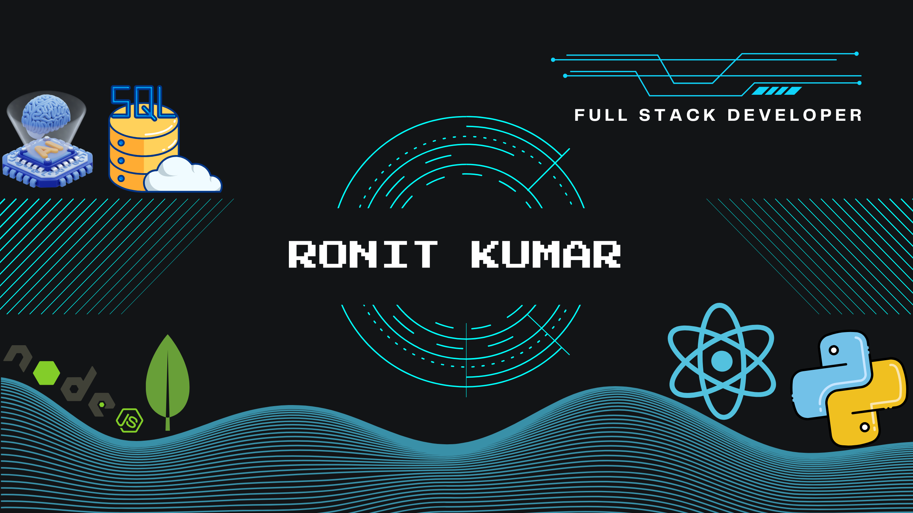

# 💫 About Me:

<h1>Hi 👋, I'm Ronit Kumar</h1>
🔭 I’m currently working as Full stack Developer intern  🌱 I’m currently learning Gen Ai  📫Reach me kumarronit8750@gmail.com  

# 💻 Tech Stack:

## 🌐 Socials:

# 📊 GitHub Stats:

 
 

## 🏆 GitHub Trophies

### 🔝 Top Contributed Repo

---

<picture>
  <source media="(prefers-color-scheme: dark)" srcset="https://raw.githubusercontent.com/itskmr/itskmr/output/github-snake-dark.svg" />
  <source media="(prefers-color-scheme: light)" srcset="https://raw.githubusercontent.com/itskmr/itskmr/output/github-snake.svg" />
  
</picture>
